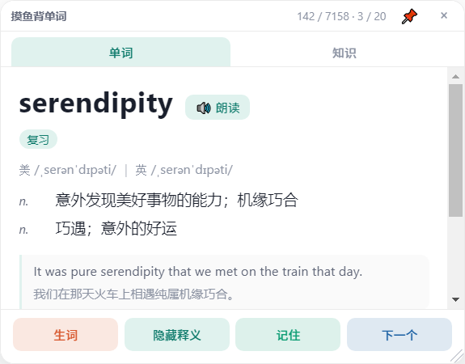
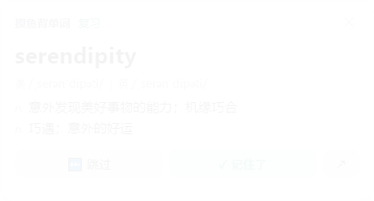
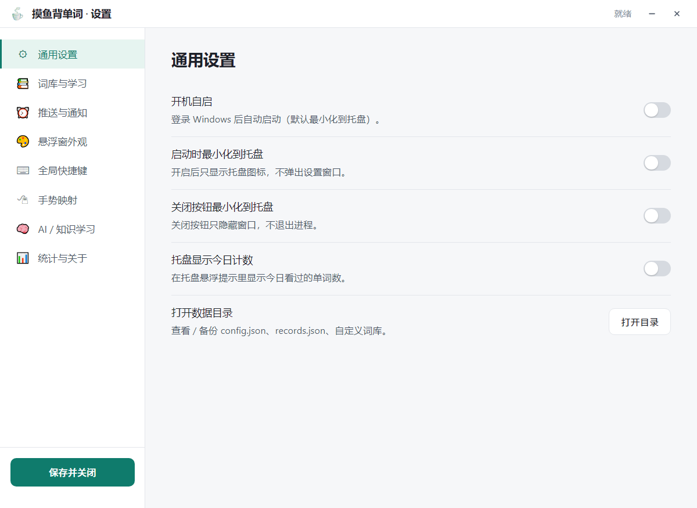

# 🐟 摸鱼背单词 · WordsFish

> 一款为「工作间隙碎片化记忆英语单词」量身打造的 Windows 桌面应用：  
> 定时从托盘气泡里冒一个单词、随时按快捷键调出可拖拽的悬浮窗、配合 SM2+ 间隔重复算法在不知不觉中背完一本词书。

    

---

## 📖 目录

- [✨ 核心特性](#-核心特性)
- [🖼 效果预览](#-效果预览)
- [🏗 技术栈](#-技术栈)
- [🧠 系统架构](#-系统架构)
- [📂 项目结构](#-项目结构)
- [🚀 快速开始](#-快速开始)
- [📦 部署与打包教程](#-部署与打包教程)
- [🛠 配置项说明](#-配置项说明)
- [📚 词库格式](#-词库格式)
- [⌨️ 快捷键 & 🖱 手势](#-快捷键---手势)
- [📈 SM2+ 复习算法](#-sm2-复习算法)
- [🧪 测试](#-测试)
- [❓ FAQ](#-faq)
- [🤝 贡献指南](#-贡献指南)
- [📄 开源协议](#-开源协议)
- [🙏 致谢](#-致谢)

---

## ✨ 核心特性

| 类别 | 功能 | 说明 |
| --- | --- | --- |
| 🫧 **托盘气泡** | 定时推送单词 | 默认每 15 分钟（±3 分钟随机扰动）从托盘冒出一个气泡，含音标 / 释义 / 例句 |
| ⌨️ **全局快捷键** | `Shift+X` 一键召唤 | 屏幕中弹出无边框置顶悬浮窗，可拖动到任意位置 |
| 🖱 **可配置手势** | 双击 / 单击 / 滚轮 / 长按 | 在设置中把每个手势映射到「关闭 / 下一个 / 标记生词 / 朗读」等动作 |
| 📚 **多词库** | 内置 4 本 7158 词 | CET-4 / CET-6 / 考研 / IELTS；同时支持自定义 JSON / JSONL / CSV / TSV / TXT 导入 |
| 🧠 **SM2+ 复习** | 间隔重复算法 | 答对拉长间隔、答错压缩间隔，连续 3 次答对且间隔 > 21 天自动标记为「已掌握」 |
| 🎨 **5 套主题** | 浅色 / 深色 / 水墨 / 薄荷 / IDE | 悬浮窗 + 气泡均可换肤 |
| 🛡 **免打扰** | 会议 / 全屏检测 | 正在演示 PPT、Zoom、Teams、OBS 时自动暂停推送 |
| ⏰ **工作时间感知** | 工作日 / 静默时段 | 仅在工作日的 9:00–18:00 推送，其它时段静默 |
| 💾 **学习进度** | 跨词库追踪 | 记录以 `bookId::word` 为键，换词库不丢进度 |
| 🚀 **开机自启** | 静默启动 | 安装时可勾选，下次开机自动拉起并最小化到托盘 |
| 🪟 **零依赖前端** | 原生 HTML/CSS/JS | 没有 React/Vue，构建体积小、启动快 |
| 🧠 **AI 知识学习** | 接入大模型 | 接入 OpenAI 兼容接口，按领域（股票 / 编程 / 医学 …）动态生成知识卡片、测验题，并支持追问；全局快捷键 `Shift+K` 呼出 |

---

## 🖼 效果预览

> 截图将在 `assets/screenshots/` 中提供（首次发版后由维护者补上）。下面先放占位图：

| 悬浮窗 | 托盘气泡 | 设置界面 |
| --- | --- | --- |
|  |  |  |

主要交互：

- 悬浮窗顶部拖拽条可拖到任意位置，关闭时位置自动保存
- 气泡右下角带「跳过 / 记住 / 打开」三个按钮
- 设置界面分 7 个分区，配置即时生效并写入 `userData/config.json`

---

## 🏗 技术栈

| 层 | 选型 | 理由 |
| --- | --- | --- |
| 壳 | **Electron 33** | 一份代码同时拿到 Node 能力和 Chromium 渲染；Windows 通知/托盘/全局快捷键/开机自启都是一等公民 |
| 主进程 | 原生 Node.js（CommonJS） | 15 个模块，零业务框架，单文件 ≤ 300 行，可读性优先 |
| 渲染层 | 原生 HTML + CSS + JS | 不引入 React/Vue；一个悬浮窗才几 KB JS，没必要为它装打包器 |
| IPC | `contextBridge` 白名单 preload | 主进程能力只暴露 `wfPopup` / `wfBubble` / `wfSettings` 三个桥 |
| 词库存储 | JSON（只读）+ JSON（学习记录） | 词库只读、记录可写，换词库不丢进度 |
| 复习算法 | SM2+（改良版） | 答对降难度 / 答错升难度，超期答对额外降难度 |
| 持久化 | `app.getPath('userData')` | 跨平台用户目录；配置 / 记录 / 统计各一个 JSON |
| 打包 | electron-builder 25 + NSIS | 一键 Windows 安装包；图标 / 快捷方式 / 卸载都内置 |

---

## 🧠 系统架构

```
┌─────────────────────────────────────────────────────────────┐
│                    Windows 操作系统                          │
│   ┌──────────────┐  ┌──────────────┐  ┌──────────────┐     │
│   │   托盘气泡    │  │  系统通知     │  │  全局快捷键   │     │
│   │  (Tray)      │  │ (Notification)│  │ (Hotkey)     │     │
│   └──────┬───────┘  └──────┬───────┘  └──────┬───────┘     │
└──────────┼────────────────┼────────────────┼──────────────┘
           │                │                │
           ▼                ▼                ▼
┌─────────────────────────────────────────────────────────────┐
│              Electron 主进程 (Node.js)                        │
│  ┌─────────┐ ┌──────────┐ ┌─────────┐ ┌──────────┐          │
│  │ tray.js │ │ notifier │ │ hotkeys │ │scheduler │  …       │
│  └────┬────┘ └─────┬────┘ └────┬────┘ └────┬─────┘          │
│       └────────┬───┴───────────┴────────┬─┘                │
│           ┌────▼─────┐         ┌────────▼────────┐          │
│           │ wordflow │ ──────► │     records     │          │
│           │ (队列)   │         │  (SM2+ 状态机)  │          │
│           └────┬─────┘         └────────┬────────┘          │
│                │                       │                    │
│           ┌────▼─────┐         ┌────────▼────────┐          │
│           │   dict   │ ──────► │  data/builtin/  │          │
│           │ (词库)   │         │  (只读 JSON)     │          │
│           └──────────┘         └─────────────────┘          │
│                                                              │
│        ┌─────────┐  ┌──────────┐  ┌──────────┐              │
│        │windows.js│ │ config.js│  │ ipc.js   │              │
│        │ (窗口)   │  │ (设置)   │  │ (通道)   │              │
│        └────┬────┘  └────┬─────┘  └────┬─────┘              │
│        ┌────▼───────────────知识学习（LLM）──────────┐        │
│        │ knowledge.js → llm.js → http.js (OpenAI 兼容)│        │
│        └─────────────────────────────────────────────┘        │
└────────────┼────────────┼─────────────┼────────────────────┘
             │            │             │
             ▼            ▼             ▼
┌─────────────────────────────────────────────────────────────┐
│  preload (contextBridge)                                       │
│  ┌──────────┐  ┌──────────┐  ┌──────────┐  ┌──────────────┐  │
│  │ popup.js │  │bubble.js │  │settings.js│  │ knowledge.js │  │
│  └──────────┘  └──────────┘  └──────────┘  └──────────────┘  │
└─────────────────────────────────────────────────────────────┘
             │            │             │             │
             ▼            ▼             ▼             ▼
┌─────────────────────────────────────────────────────────────┐
│  渲染层 (Chromium)                                             │
│  悬浮窗 / 气泡 / 设置 / 知识学习 四个 BrowserWindow            │
└─────────────────────────────────────────────────────────────┘
```

详细四层职责见 [`docs/architecture.md`](docs/architecture.md)（待补）。

---

## 📂 项目结构

```
words-fish/
├── src/
│   ├── main/                       # 主进程（Node.js）
│   │   ├── main.js                 # 入口：单实例锁、初始化
│   │   ├── ipc.js                  # IPC handler 注册 + 手势分发
│   │   ├── ipc-dialog.js           # 导入文件对话框
│   │   ├── windows.js              # 三层窗口（popup/bubble/settings）
│   │   ├── tray.js                 # 系统托盘 + 右键菜单
│   │   ├── notifier.js             # 推送分发（bubble/system/popup）
│   │   ├── scheduler.js            # 定时器 + 静默/会议检测
│   │   ├── hotkeys.js              # 全局快捷键注册
│   │   ├── autolaunch.js           # 开机自启
│   │   ├── wordflow.js             # 单词历史队列
│   │   ├── records.js              # 学习记录 + SM2+ 状态机
│   │   ├── dict.js                 # 词库引擎（加载/导入/转换）
│   │   ├── config.js               # 配置管理（订阅/防抖/持久化）
│   │   ├── constants.js            # 手势/动作/快捷键/主题常量
│   │   └── paths.js                # 跨平台路径解析
│   ├── preload/                    # 渲染层桥（contextBridge）
│   │   ├── popup.js
│   │   ├── bubble.js
│   │   └── settings.js
│   └── renderer/                   # 渲染层（HTML/CSS/JS）
│       ├── popup/                  # 悬浮窗
│       ├── bubble/                 # 托盘气泡
│       └── settings/               # 设置窗口（7 个分区）
├── data/
│   └── builtin/                    # 内置词库（只读 JSON）
│       ├── cet4.json               # 1162 词
│       ├── cet6.json               # 1228 词
│       ├── kaoyan.json             # 1341 词
│       ├── ielts.json              # 3427 词
│       └── index.json
├── assets/
│   ├── icon.ico                    # 应用图标（多尺寸）
│   ├── icon.png
│   ├── tray.png                    # 托盘图标
│   └── tray-paused.png
├── scripts/
│   ├── build-dict.js               # 词库转换（kajweb/dict → 精简格式）
│   └── gen-icons.js                # 程序化生成图标（纯 Node）
├── tests/                          # 自动化测试
│   ├── logic-test.js               # 50 项逻辑测试
│   ├── verify-headless.js          # 24 项无头集成测试
│   ├── render-test.js              # 渲染层 jsdom 测试（待修复）
│   ├── fixtures/                   # 测试数据
│   │   ├── sample.csv
│   │   ├── sample.json
│   │   ├── sample.jsonl
│   │   └── sample.txt
│   └── README.md
├── package.json
├── package-lock.json
├── LICENSE                         # Apache 2.0
└── README.md
```

---

## 🚀 快速开始

### 环境要求

| 工具 | 版本 | 说明 |
| --- | --- | --- |
| Node.js | ≥ 18 | 推荐 20 LTS |
| npm | ≥ 9 | 自带 |
| Windows | 10 / 11 | 其它平台可跑主进程但部分功能（托盘/全局快捷键）需自行验证 |
| 磁盘 | 200 MB | 主要是 Electron 二进制 |

### 三步跑起来

```bash
# 1. 克隆
git clone https://github.com/cv-superding/words-fish.git
cd words-fish

# 2. 安装依赖
npm install
# 第一次会下载 ~200MB 的 Electron；如卡在 electron-builder 镜像
# 可临时换源：npm config set ELECTRON_MIRROR https://npmmirror.com/mirrors/electron/

# 3. 启动
npm start
```

启动后：

1. 屏幕右下角出现 🐟 托盘图标
2. 默认 15 分钟后第一个气泡会冒出来
3. 按 `Shift+X` 召唤悬浮窗
4. 右键托盘 → 「设置」可改一切

### 第一次跑就报错的常见原因

- **托盘图标没出现** → 检查 Windows 任务管理器是否把 `electron.exe` 拒了
- **`globalShortcut.register` 报错** → 其它程序占用了 `Shift+X`；先去设置里换一个
- **气泡是英文** → 默认词库是 CET-4，先在「词库」分区切到 IELTS
- **`npm install` 极慢** → 配置 `ELECTRON_MIRROR` 国内镜像

---

## 📦 部署与打包教程

> 本节从开发到分发全流程走通，每一步都列出命令和预期结果。

### A. 开发模式（推荐日常使用）

```bash
# 直接跑
npm start

# 跑并打开开发者工具（悬浮窗 / 气泡 / 设置三个窗口都开 DevTools）
npm run dev
```

`--dev` 模式额外做的事：

- 打开所有 BrowserWindow 的 DevTools（`Ctrl+Shift+I`）
- 关闭硬件加速（部分虚拟机上更稳定）
- 启动时打印 `paths.userDir` 方便调试

修改源码后的热更新粒度：

- **主进程**：需重启（`Ctrl+C` → `npm start`）
- **渲染层 HTML/CSS/JS**：保存即生效（Electron 自动 reload）

### B. 本地构建安装包（不发布，只在本机用）

```bash
# 仅构建目录（快速验证，不打 NSIS）
npm run pack
# 产物：release/win-unpacked/WordsFish.exe
# 双击即可运行，无需安装

# 完整 NSIS 安装包
npm run build
# 产物：release/WordsFish Setup 1.0.0.exe
```

NSIS 安装器特性：

- 可选安装路径（默认 `C:\Program Files\WordsFish`）
- 创建桌面快捷方式
- 创建开始菜单快捷方式
- 卸载时清理 `userData`（可在安装器中关闭）
- 体积约 80 MB（含 Electron runtime）

### C. 自定义图标 / 词库

#### 替换应用图标

```bash
# 准备一张 1024x1024 PNG → assets/icon.png
# 程序化生成多尺寸 .ico
node scripts/gen-icons.js
# 重新打包
npm run build
```

#### 替换/扩充内置词库

```bash
# 输入 kajweb/dict 的 JSONL 格式
node scripts/build-dict.js \
  --input ./raw-dict/cet4.jsonl \
  --output ./data/builtin/cet4.json \
  --max-words 2000
```

脚本细节见 [`scripts/build-dict.js`](scripts/build-dict.js)。  
也可以直接编辑 `data/builtin/cet4.json`（结构见下文 [词库格式](#-词库格式)）。

### D. 发布到 GitHub Releases

```bash
# 1. 在 GitHub 创建 release（v1.0.0）并上传安装包
# 2. 触发 electron-builder 自动发布（需配置 GH_TOKEN）
export GH_TOKEN=ghp_xxxxxxxxxxxxxxxx
npm run build -- --publish always
```

产物会被自动 attach 到对应 release，并生成 `latest.yml` 供自动更新使用。

### E. 自动更新（可选）

修改 `package.json`：

```jsonc
"build": {
  "publish": {
    "provider": "github",
    "owner": "cv-superding",
    "repo": "words-fish"
  }
}
```

主进程 `src/main/main.js` 启动时调用 `autoUpdater.checkForUpdates()` 即可。  
本仓库 v1.0.0 未启用，留作后续 milestone。

### F. 跨平台（macOS / Linux）

> 本项目主目标是 Windows，但 Electron 本身跨平台。macOS / Linux 也能跑：

```bash
# macOS
npm install
npm start

# Linux（需先装 libgtk-3）
sudo apt install libgtk-3-0 libnotify4 libnss3 libxss1 libxtst6 xauth
npm start
```

已知差异：

- `app.setLoginItemSettings` 在 macOS 上需用 `openAtLogin` 而非 `openAsHidden`
- 系统通知样式按平台自动适配
- 托盘图标在 GNOME 上需 `libappindicator3-1` 扩展

### G. CI/CD（GitHub Actions 示例）

`.github/workflows/release.yml`：

```yaml
name: Build & Release
on:
  push:
    tags: ['v*']
jobs:
  build:
    runs-on: windows-latest
    steps:
      - uses: actions/checkout@v4
      - uses: actions/setup-node@v4
        with: { node-version: 20 }
      - run: npm ci
      - run: npm run build
        env: { GH_TOKEN: ${{ secrets.GITHUB_TOKEN }} }
      - uses: softprops/action-gh-release@v2
        with:
          files: release/*.exe
```

---

## 🛠 配置项说明

配置存放在 `userData/config.json`（Windows 上为 `%APPDATA%\WordsFish\config.json`）。  
设置窗口的所有改动都立即生效，并防抖（500ms）写盘。

| 路径 | 默认值 | 说明 |
| --- | --- | --- |
| `general.startMinimized` | `false` | 启动时是否最小化到托盘 |
| `general.language` | `"zh-CN"` | UI 语言（预留） |
| `push.intervalMin` | `15` | 推送间隔（分钟） |
| `push.jitterMin` | `3` | 间隔随机扰动范围（±分钟） |
| `push.channel` | `"bubble"` | 推送通道：`bubble` / `system` / `popup` |
| `push.workdayOnly` | `true` | 仅工作日推送 |
| `push.workHours` | `{ start: 9, end: 18 }` | 工作时间窗口 |
| `push.fullscreenPause` | `true` | 全屏演示时暂停 |
| `popup.theme` | `"light"` | 主题：`light` / `dark` / `ink` / `mint` / `ide` |
| `popup.opacity` | `0.96` | 悬浮窗透明度（0.3–1.0） |
| `popup.fontSize` | `1` | 字体缩放（0.8–1.4） |
| `popup.position` | `{ x: -1, y: -1 }` | 悬浮窗位置（-1 = 屏幕居中） |
| `hotkeys.togglePopup` | `"Shift+X"` | 召唤 / 关闭悬浮窗 |
| `hotkeys.nextWord` | `"Shift+C"` | 下一个单词 |
| `hotkeys.markUnknown` | `"Shift+Z"` | 标记为生词 |
| `hotkeys.toggleMeaning` | `""` | 切换释义显隐 |
| `hotkeys.openSettings` | `""` | 打开设置窗口 |
| `hotkeys.panic` | `"Shift+Escape"` | 紧急：隐藏所有窗口 + 暂停推送 |
| `gestures.click` | `"none"` | 单击 |
| `gestures.dblclick` | `"close"` | 双击 |
| `gestures.rightclick` | `"markUnknown"` | 右键 |
| `gestures.middleclick` | `"toggleMeaning"` | 中键 |
| `gestures.wheelUp` | `"prevWord"` | 滚轮上 |
| `gestures.wheelDown` | `"nextWord"` | 滚轮下 |
| `gestures.longpress` | `"speak"` | 长按 520ms |
| `study.activeBook` | `"cet4"` | 当前词库 ID |
| `study.exposeAll` | `false` | 是否允许向「已掌握」单词继续推送 |
| `study.markedPriority` | `true` | 选词时是否生词优先 |

可用动作：`none` / `close` / `nextWord` / `prevWord` / `toggleMeaning` / `markUnknown` / `markKnown` / `speak` / `togglePin` / `copyWord` / `openSettings`  
可用事件：`click` / `dblclick` / `rightclick` / `middleclick` / `wheelUp` / `wheelDown` / `longpress`

---

## 📚 词库格式

内置词库使用精简 JSON 格式，每本词库一个文件：

```jsonc
// data/builtin/cet4.json（节选）
{
  "id": "cet4",
  "name": "CET-4 词汇",
  "lang": "en",
  "source": "kajweb/dict (CC BY-NC-SA)",
  "version": 1,
  "words": [
    {
      "w": "abandon",                  // 必填：单词
      "us": "/əˈbændən/",              // 美式音标
      "uk": "/əˈbændən/",              // 英式音标
      "t": [                           // 必填：释义列表
        { "p": "v.", "c": "放弃；抛弃" },
        { "p": "n.", "c": "放纵" }
      ],
      "ph": [                          // 短语
        { "p": "abandon oneself to", "c": "沉溺于" }
      ],
      "e": "He abandoned his car in the storm.",   // 英文例句
      "ec": "他在暴风雨中弃车而去。",                 // 例句翻译
      "m": "syn: desert; ant: keep"               // 备注
    }
  ]
}
```

### 支持的导入格式

| 格式 | 扩展名 | 一行一条 | 列数 |
| --- | --- | --- | --- |
| JSON | `.json` | 否 | 数组 |
| JSONL | `.jsonl` / `.ndjson` | 是 | 对象 |
| CSV | `.csv` | 是 | 至少 1 列：单词 |
| TSV | `.tsv` | 是 | 至少 1 列：单词 |
| TXT | `.txt` | 是 | 单词 [+ 释义] |

CSV / TSV 列名自动识别（不区分大小写）：

- `word` / `w` / `单词`
- `us` / `usphone` / `美`
- `uk` / `ukphone` / `英`
- `pos` / `p` / `词性`
- `cn` / `c` / `translation` / `释义`
- `example` / `e` / `例句`
- `example_cn` / `ec` / `例句翻译`

导入后词库文件落在 `userData/dicts/u_<slug>_<timestamp>.json`，可在设置中重命名 / 删除。

### 重新生成内置词库

```bash
# 从 kajweb/dict 拉取并转换
git clone https://github.com/kajweb/dict.git /tmp/dict
node scripts/build-dict.js \
  --input /tmp/dict/youdao/CET4_T.json \
  --output data/builtin/cet4.json \
  --max-words 2000
```

---

## ⌨️ 快捷键 & 🖱 手势

### 默认快捷键

| 快捷键 | 动作 |
| --- | --- |
| `Shift+X` | 召唤 / 关闭悬浮窗（任意位置） |
| `Shift+C` | 下一个单词（悬浮窗内） |
| `Shift+Z` | 标记为生词 |
| `Shift+Esc` | **紧急**：隐藏所有窗口 + 暂停推送 30 分钟 |

> 快捷键在「设置 → 全局快捷键」中可改。若与其它软件冲突，注册失败时托盘会冒气泡提示。

### 鼠标手势

默认手势映射（可在设置中改）：

| 手势 | 默认动作 |
| --- | --- |
| 单击 | 无（避免误触） |
| **双击** | **关闭悬浮窗** |
| 右键 | 标记生词 |
| 中键 | 切换释义显隐 |
| 滚轮上 | 上一词 |
| 滚轮下 | 下一词 |
| 长按 520ms | 朗读（Windows TTS） |

所有手势目标可映射到任意动作，且支持**渲染层**（悬浮窗内）和**主进程全局**（托盘菜单）两套独立配置。

---

## 📈 SM2+ 复习算法

本项目对经典 SM-2 做了一点适配：把离散 EF 换成连续 difficulty ∈ [0, 1]，让「碎片化推送」也能跑出合理间隔。

**核心公式**（实现见 `src/main/records.js`）：

```js
// 答对：难度下降（超期答对额外多降）
rec.d = clamp(rec.d + 0.18 * (factor - performance), 0, 1);
where factor = clamp(expectedRatio, 0, 2);  // expectedRatio = 实际间隔 / 期望间隔

// 答错：难度上升
factor = 1 + (1 - performance);
rec.d = clamp(rec.d + 0.18 * (factor - performance), 0, 1);

// EF 由难度推导
EF = clamp(2.5 - 1.2 * rec.d, 1.3, 2.6);

// 答对时拉长间隔
rec.i = clamp(prev_i * EF * (1 + 0.15 * overdueBoost), 10分钟, 365天);

// 答错时压缩间隔
rec.i = clamp(prev_i / (EF * EF), 10分钟, 365天);

// 连续 3 次答对且间隔 ≥ 21 天 → known（不再推送）
// 答错 → 降回 learning
```

**选词策略**（`records.pick`）：

1. **生词优先**（被手动标记的）
2. **到期复习**（`due <= now`）
3. **新词**（`n === 0` 且非 known）
4. 已掌握（默认跳过，除非 `study.exposeAll = true`）

---

## 🧠 知识学习模块（AI / LLM）

把「碎片化背单词」扩展到「碎片化学知识」：接入任意 **OpenAI 兼容**的大模型接口，按领域动态生成通俗易懂的知识卡片、测验题，并进行追问式学习。

### 它能做什么

- **领域预设**：股票投资、金融与经济、编程开发、历史人文、医学健康、科学科普、法律常识，以及「自定义领域」（如围棋、咖啡、心理学…）。
- **三种学习模式**（界面底部切换）：
  - **我问你答**：自由提问，模型结合当前会话上下文连续作答。
  - **知识卡片**：每次生成一张 `## 概念 / ## 释义 / ## 例子 / ## 要点` 的 Markdown 知识卡片，适合快速通读。
  - **来道题**：生成一道单选题 + 答案 + 解析，自测掌握程度。
- **流式输出**：回答逐字流式渲染（打字机效果），底部显示模型名与 token 消耗，可一键复制。
- **会话持久化**：每个领域的对话历史存于 `userData/knowledge.json`，重启不丢；可一键清空。
- **全局快捷键**：`Shift+K` 呼出知识窗口（托盘菜单也有入口）。

### 如何配置（设置 → AI / 知识学习）

| 配置项 | 说明 | 默认值 |
| --- | --- | --- |
| 启用 | 是否启用 AI 知识学习 | 关 |
| API 地址 (Base URL) | OpenAI 兼容接口地址，含 `/v1` 也可 | `https://api.openai.com/v1` |
| API 密钥 | Bearer Token，仅存本地 | 空 |
| 模型名称 | 如 `gpt-4o-mini`、`deepseek-chat` | `gpt-4o-mini` |
| 温度 | 0~2，越大越发散 | `0.7` |
| 最大 Token | 单次回复上限 | `900` |
| 超时 | 请求超时毫秒 | `30000` |
| HTTP 代理 | 可选，如 `http://127.0.0.1:7890`；访问被墙接口时走代理（CONNECT 隧道） | 空 |
| 系统提示词 | 知识讲解风格（可自定义） | 内置中文助教模板 |

兼容示例：OpenAI、Azure OpenAI、DeepSeek、通义千问、本地 **Ollama**（`baseUrl=http://localhost:11434/v1`）、vLLM 等任意实现 `/v1/chat/completions` 的服务。

> 配置只保存在本机 `userData/config.json`，不会上传。

### 架构

```
renderer/knowledge/  ──(wfKnowledge)──▶  ipcMain 'knowledge:*'
                                        └─▶ src/main/knowledge.js   （领域预设 / 会话 / 历史）
                                            └─▶ src/main/llm.js        （OpenAI 兼容 chat/completions）
                                                └─▶ src/main/http.js     （纯 Node HTTP/SSE + 代理隧道）
```

- `http.js`：零依赖 HTTP 客户端，支持 http/https、流式 SSE、超时、AbortSignal，以及通过 HTTP 代理 `CONNECT` 隧道访问被墙接口。
- `llm.js`：封装 `POST {baseUrl}/chat/completions`，流式时用 SSE 增量拼接，非流式直接解析 JSON。
- `knowledge.js`：管理「领域 → 会话 → 消息历史」，按领域内置系统提示词与卡片/测验模板，历史落盘 `knowledge.json`。

### 测试覆盖

`tests/llm-test.js`（**23 项**）起本地 mock OpenAI 服务器，覆盖流式/非流式、错误码透传、会话历史、自定义领域、连接测试等。

---

## 🧪 测试

```bash
# 全部测试（50 逻辑 + 33 集成 + 23 LLM）
npm test

# 仅逻辑测试（纯 Node，无需 Electron）
npm run test:logic

# 仅无头集成测试（桩件模拟 electron）
npm run test:integration > tests/verify-report.txt

# 仅 LLM / 知识学习集成测试（mock 服务器，纯 Node）
npm run test:llm
```

测试脚本位于 `tests/`：

| 套件 | 数量 | 内容 |
| --- | --- | --- |
| `tests/logic-test.js` | **50** | 配置默认值 / 4 本词库加载 / 4 种导入格式 / SM2+ 正确性 / 选词策略 / 切换词库不丢进度 / 失效回退 / 手势映射 / 热键默认 / 清理 |
| `tests/verify-headless.js` | **33** | 主进程初始化链路 / 全部 IPC 通道 / 单词流转 / 手势分发 / 通知 / 窗口 / 配置热更新 / 持久化落盘 / 知识学习 IPC |
| `tests/llm-test.js` | **23** | OpenAI 兼容接口：流式 SSE 拼接 / 非流式 / 错误透传 / 知识会话 / 自定义领域 / 连接测试 |
| `tests/render-test.js` | — | 渲染层 jsdom 集成（需要 `npm i jsdom`；当前环境依赖损坏，待修复） |

> 当前环境（沙箱）无法启动 GUI，因此用桩件模拟 `electron` 模块。**最终视觉验证请在你本机跑 `npm start`**。

---

## ❓ FAQ

<details>
<summary><b>Q1：托盘气泡定时没出现？</b></summary>

依次检查：

1. 系统时间是否在工作日 + 工作时间内（默认 9:00–18:00）
2. 是否处于全屏演示（PPT / Zoom / Teams / OBS 会被自动暂停）
3. 设置中是否勾了「暂停推送」
4. 托盘右键 → 「立即推送」是否能手动触发

</details>

<details>
<summary><b>Q2：全局快捷键按了没反应？</b></summary>

- 某些 Windows 独占全屏程序（如部分游戏）会拦截全局快捷键，无法绕过
- 改用「设置 → 推送」调小间隔，让气泡自己冒出来

</details>

<details>
<summary><b>Q3：导入的 CSV 全部乱码？</b></summary>

- 确保 CSV 是 **UTF-8** 编码（Excel 默认是 GBK，另存为 UTF-8 即可）
- 或先用 VSCode / Notepad++ 转码

</details>

<details>
<summary><b>Q4：怎么彻底卸载？</b></summary>

- 控制面板 → 程序与功能 → WordsFish → 卸载
- 残留文件：删除 `%APPDATA%\WordsFish` 即可清空所有配置和记录

</details>

<details>
<summary><b>Q5：词库是哪儿来的？能不能商用？</b></summary>

内置 4 本词库源自 [kajweb/dict](https://github.com/kajweb/dict)（基于有道词典数据），遵循 **CC BY-NC-SA 4.0**（非商业、相同方式共享）。  
**本项目仅供学习与个人使用，不得用于商业用途**。如需商用请自行替换词库源。

</details>

<details>
<summary><b>Q6：词库换完之后我的学习记录还在吗？</b></summary>

在。记录以 `bookId::word` 为键，换词库不影响其它词库的学习进度。  
词库内重新导入同一本书时，新词会被重新学习，旧词保留状态。

</details>

---

## 🤝 贡献指南

欢迎提 Issue 和 PR！请遵守以下约定：

1. **Fork → 新分支**：`feature/<name>` 或 `fix/<name>`
2. **代码风格**：
   - 主进程 Node.js：CommonJS、2 空格缩进、单引号、ES2022 语法
   - 渲染层：原生 ES5/ES2017（不引入打包器，浏览器直接跑）
3. **测试**：`npm test` 必须全绿
4. **提交信息**：[Conventional Commits](https://www.conventionalcommits.org/)（如 `feat: add dark theme to bubble`）
5. **PR 描述**：列出改了什么、为什么改、怎么测的

**未来方向**（欢迎认领）：

- [ ] macOS / Linux 平台适配
- [ ] TTS 引擎可换（当前用 Windows SAPI）
- [ ] 例句发音
- [ ] 词频统计 + 艾宾浩斯曲线图
- [ ] 同步到 Anki
- [ ] 多语言界面（English / 日本語）

---

## 📄 开源协议

本项目采用 **[Apache License 2.0](LICENSE)**。

```
Copyright 2026 Ding Li (cv-superding)

Licensed under the Apache License, Version 2.0 (the "License");
you may not use this file except in compliance with the License.
You may obtain a copy of the License at

    http://www.apache.org/licenses/LICENSE-2.0
```

主要权利：

- ✅ 商用、修改、分发、私用
- ✅ 专利授权
- ⚠️ 必须保留版权 / 许可证 / 变更说明
- ⚠️ 不得使用作者姓名 / 商标做 endorsement

**注意**：内置词库基于 [kajweb/dict](https://github.com/kajweb/dict)（CC BY-NC-SA 4.0），有非商用约束；如需商用请替换词库。

---

## 🙏 致谢

- [ToastFish](https://github.com/Uahh/ToastFish) —— 启发本项目的核心思路，MIT 协议
- [kajweb/dict](https://github.com/kajweb/dict) —— 词库数据源，CC BY-NC-SA 4.0
- [Electron](https://www.electronjs.org/) —— 跨平台桌面应用运行时
- [electron-builder](https://www.electron.build/) —— 一键打包 / 安装器生成
- [SuperMemo-2](https://www.supermemo.com/en/blog/application-of-a-computer-to-improve-the-results-obtained-in-working-with-the-supermemo-method) —— 间隔重复算法的鼻祖

---

## 📮 联系方式

- **作者**：Ding Li ([@cv-superding](https://github.com/cv-superding))
- **问题反馈**：[GitHub Issues](https://github.com/cv-superding/words-fish/issues)
- **邮件**：（可在 GitHub profile 查看）

---

> ⭐ 如果这个项目对你有帮助，欢迎在 GitHub 上点亮 Star！  
> 🐛 任何 Bug / 建议都欢迎提 Issue，这是项目继续迭代的最大动力。
